# Facial Expression Recognition with CNNs — FER-2013

A deep learning portfolio project that classifies facial expressions from face images using Convolutional Neural Networks (CNNs).

The project uses the **FER-2013** dataset, which contains 48x48 grayscale face images divided into seven emotion classes:

- angry
- disgust
- fear
- happy
- neutral
- sad
- surprise

This repository includes a complete machine learning workflow:

1. Dataset exploration
2. Data preprocessing
3. Baseline CNN model
4. Improved CNN model
5. Model comparison
6. Detailed evaluation
7. Single-image prediction
8. Gradio demo app with face detection preprocessing

---

## Project Highlights

- Built a working CNN model for facial expression classification
- Compared a simple baseline CNN with an improved CNN
- Used dropout, batch normalization, data augmentation and EarlyStopping
- Evaluated the model using accuracy, loss, precision, recall, F1-score and confusion matrices
- Built a Gradio app where users can upload or capture a face image and get an emotion prediction
- Added face detection and cropping to improve real-world camera predictions

---

## Repository Structure

The final project structure is expected to look like this:

```text
Facial-Expression-Recognition-with-CNNs-FER-2013/
│
├── app/
│   └── gradio_app.py
│
├── data/
│   └── FER-2013/
│       ├── train/
│       │   ├── angry/
│       │   ├── disgust/
│       │   ├── fear/
│       │   ├── happy/
│       │   ├── neutral/
│       │   ├── sad/
│       │   └── surprise/
│       │
│       └── test/
│           ├── angry/
│           ├── disgust/
│           ├── fear/
│           ├── happy/
│           ├── neutral/
│           ├── sad/
│           └── surprise/
│
├── images/
│   ├── class_distribution.png
│   ├── sample_images.png
│   ├── data_augmentation_examples.png
│   ├── training_curves_baseline.png
│   ├── training_curves_improved.png
│   ├── confusion_matrix.png
│   ├── confusion_matrix_normalized.png
│   ├── f1_score_per_class.png
│   ├── multiple_prediction_examples.png
│   ├── single_prediction_example.png
│   ├── single_prediction_probabilities.png
│   ├── App screen shoot 1.png
│   ├── App screen shoot 2.png
│   └── App screen shoot 3.png
│
├── models/
│   ├── baseline_model.keras
│   ├── improved_model.keras
│   └── best_model.keras
│
├── notebooks/
│   └── facial_expression_recognition_fer2013.ipynb
│
├── README.md
├── requirements.txt
└── .gitignore
```

> The dataset is not included in this repository because it contains many image files. Download or extract the FER-2013 dataset locally into the `data/FER-2013/` folder.

---

## Dataset

The dataset contains grayscale facial images with size **48x48 pixels**.

The data is already split into:

- training data
- test data

Each class has its own folder.

### Class Distribution

The training data is imbalanced. Some classes contain many more images than others.

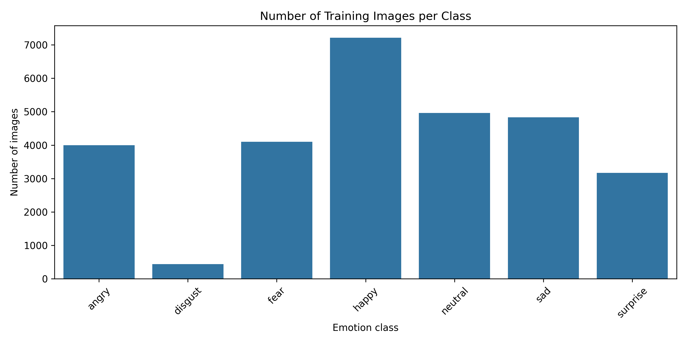

The `happy` class has the most training examples, while the `disgust` class has far fewer images. This imbalance affects model performance, especially for smaller classes.

### Sample Images

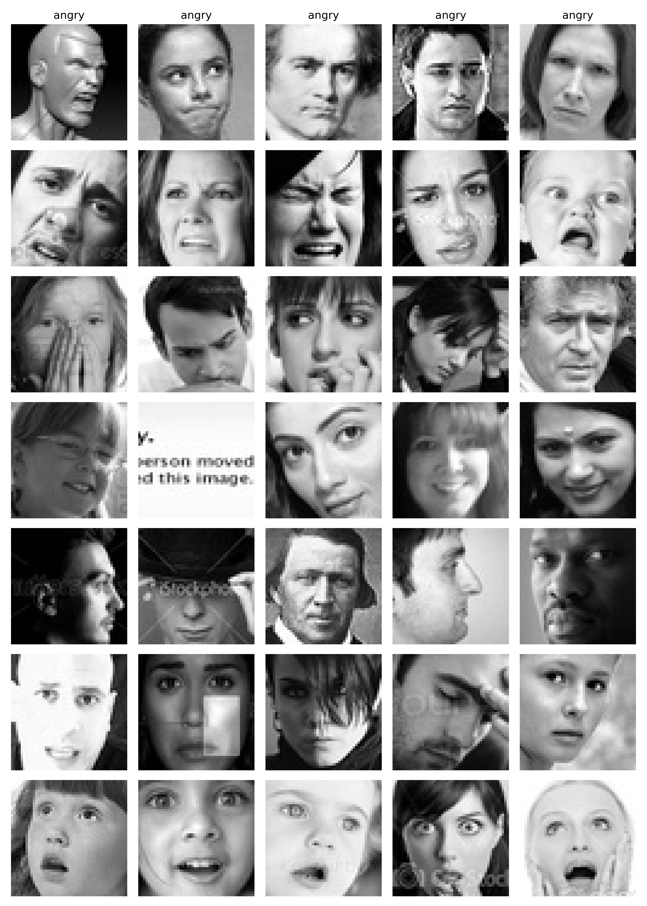

The images are small and grayscale. Some emotions are visually similar, which makes the task challenging.

---

## Data Preprocessing

The images were prepared for the CNN model using the following steps:

- loaded as grayscale images
- resized to 48x48 pixels
- normalized from pixel values 0-255 to values between 0 and 1
- divided into training, validation and test datasets
- loaded in batches for efficient training

The input shape used by the model is:

```text
(48, 48, 1)
```

The `1` means the image has one grayscale channel.

---

## Data Augmentation

Data augmentation was used in the improved model to help reduce overfitting.

The augmentation included:

- horizontal flipping
- small rotations
- zoom
- small translations

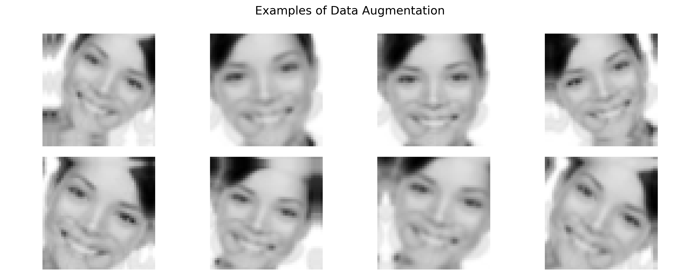

Data augmentation helps the model learn more flexible patterns instead of memorizing exact training images.

---

## Models

Two CNN models were trained and compared.

### 1. Baseline CNN

The baseline model used a simple CNN architecture:

- Conv2D layers
- MaxPooling2D layers
- Flatten layer
- Dense layer
- Softmax output layer

The baseline model was used as a reference point.

### 2. Improved CNN

The improved model added several techniques:

- more convolutional layers
- batch normalization
- dropout
- data augmentation
- EarlyStopping
- ModelCheckpoint

The purpose was to improve generalization and reduce overfitting.

---

## Model Results

| Model | Test Loss | Test Accuracy |
|---|---:|---:|
| Baseline CNN | 1.2090 | 55.27% |
| Improved CNN | 1.0819 | 58.40% |

The improved CNN performed better than the baseline CNN.

The accuracy increased by approximately **3.13 percentage points**, and the test loss decreased from **1.2090** to **1.0819**.

This shows that the added techniques helped the model generalize better to unseen test images.

---

## Training Curves

### Baseline CNN

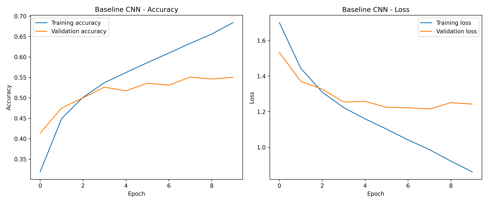

The baseline model improved on the training data, but the validation performance increased more slowly. This suggests that the baseline model had limited generalization.

### Improved CNN

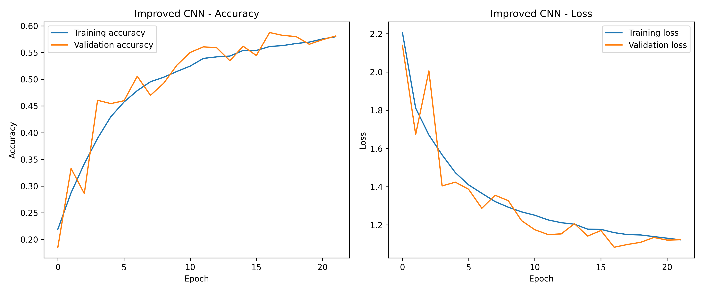

The improved model showed better validation performance and lower test loss. EarlyStopping stopped training when validation performance stopped improving, helping reduce overfitting.

---

## Detailed Evaluation

Overall accuracy is useful, but it does not show how well the model performs for each class. Therefore, the improved model was also evaluated using:

- classification report
- confusion matrix
- normalized confusion matrix
- F1-score per class

### Classification Report Summary

| Class | Precision | Recall | F1-score | Support |
|---|---:|---:|---:|---:|
| angry | 0.51 | 0.46 | 0.48 | 958 |
| disgust | 0.71 | 0.05 | 0.08 | 111 |
| fear | 0.48 | 0.22 | 0.31 | 1024 |
| happy | 0.77 | 0.86 | 0.82 | 1774 |
| neutral | 0.48 | 0.69 | 0.56 | 1233 |
| sad | 0.44 | 0.49 | 0.46 | 1247 |
| surprise | 0.76 | 0.64 | 0.69 | 831 |

### Confusion Matrix

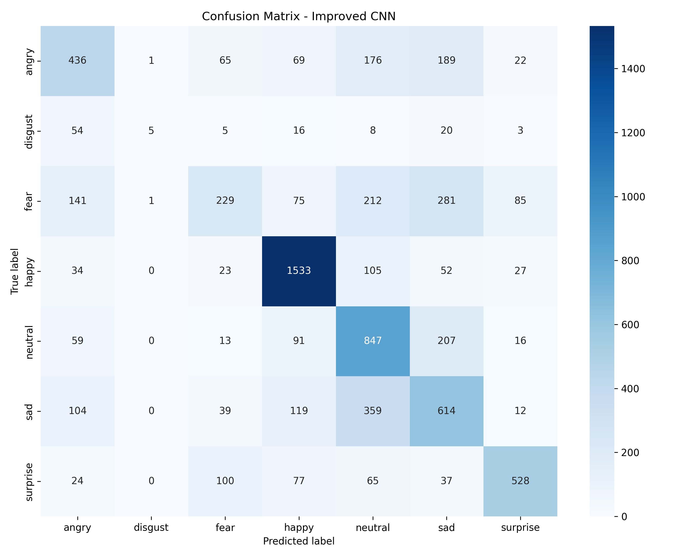

The confusion matrix shows which classes are predicted correctly and which classes are confused with each other.

### Normalized Confusion Matrix

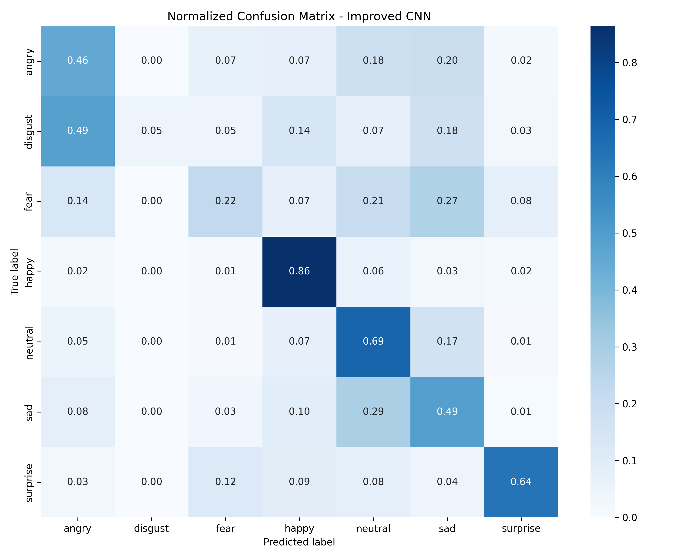

The normalized confusion matrix makes it easier to compare class performance using percentages.

### F1-score per Class

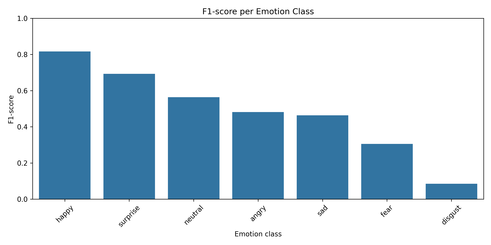

The model performs best on:

- happy
- surprise
- neutral

The model struggles most with:

- disgust
- fear
- sad

The `disgust` class performs worst because it has very few training examples compared with the other classes.

---

## Prediction Examples

The trained model was used to make predictions on unseen test images.

### Single Prediction Example

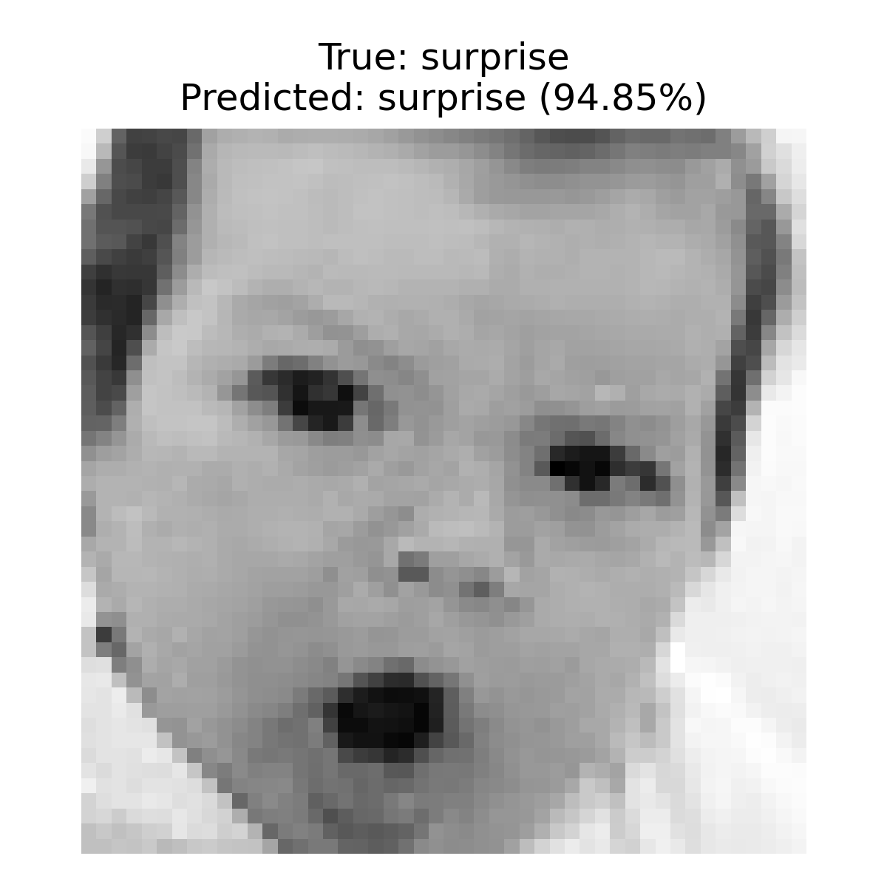

### Single Prediction Probabilities

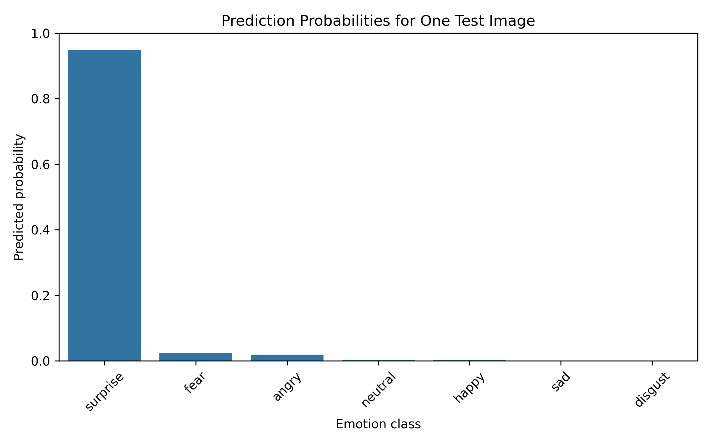

The model predicted the test image as `surprise` with high confidence.

### Multiple Prediction Examples

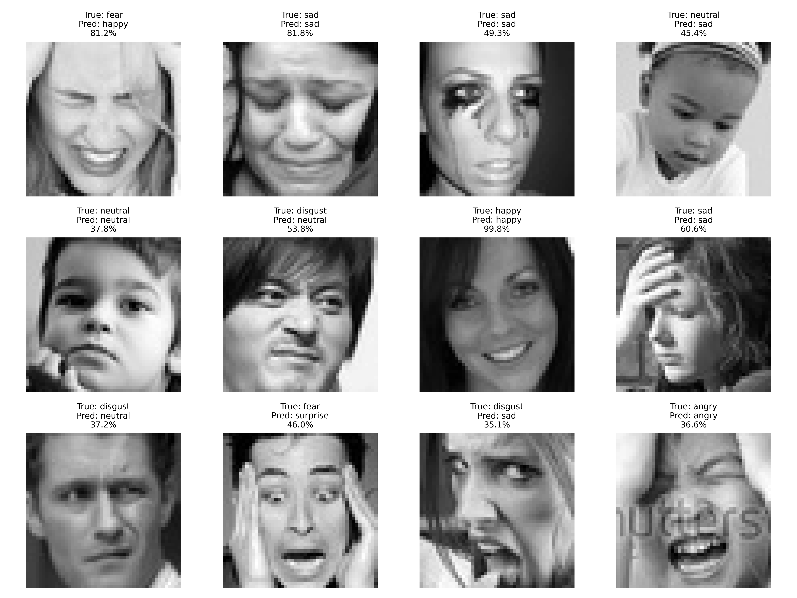

Some predictions are correct and some are incorrect. This is expected because facial expressions can be visually similar, especially in low-resolution grayscale images.

---

## Gradio Demo App

A Gradio app was created to make the model interactive.

The app allows the user to:

- upload an image
- use the webcam to capture a face image
- run the trained CNN model
- view prediction confidence scores
- inspect how preprocessing affects the result

Run the app with:

```powershell
C:\venvs\fer2013\Scripts\python.exe app\gradio_app.py
```

Then open the local Gradio link in the browser:

```text
http://127.0.0.1:7860
```

---

## Real-world App Testing

When testing the first app version with real camera images, the model often predicted incorrectly.

This happened because the first version sent the full camera image into the model.

The full camera image contained:

- background
- shoulders
- lighting differences
- a face that was not cropped like the FER-2013 training images

This created a problem called **domain shift**.

The model was trained on cropped 48x48 grayscale face images, but it was asked to predict on larger real-world webcam images.

### Before Face Detection and Cropping


In this version, the model predicted `angry` for a smiling face. This happened because the input image did not match the format of the training data.

### After Face Detection and Cropping

To improve the app, face detection and cropping were added using OpenCV.

The new app flow is:

```text
uploaded image → face detection → face crop → grayscale → resize to 48x48 → model prediction
```

This made the input much closer to the FER-2013 training format.


After adding face detection and cropping, the app gave more realistic results:

| Expression | Prediction | Confidence |
|---|---|---:|
| surprised face | surprise | 71.17% |
| smiling face | happy | 99.48% |

This shows that preprocessing is extremely important in deep learning. A good model can still fail if the input data does not match the data it was trained on.

---

## Important Machine Learning Lessons

This project demonstrates several important deep learning concepts:

### 1. CNNs are useful for image classification

CNNs can learn image features automatically from pixel data.

Early layers can learn simple patterns such as edges and shadows, while deeper layers can learn more complex facial expression patterns.

### 2. Model comparison matters

A baseline model is useful because it gives a reference point. The improved CNN performed better than the baseline, showing that architecture and regularization choices affected the result.

### 3. Accuracy alone is not enough

The confusion matrix and classification report showed that the model performed very differently between classes.

For example, `happy` performed well, while `disgust` performed poorly.

### 4. Class imbalance affects performance

The `disgust` class had far fewer examples than the other classes. The model rarely detected it correctly.

### 5. Preprocessing must match training data

The Gradio app improved significantly after adding face detection and cropping. This showed that real-world inputs must be prepared in the same way as the training data.

### 6. Deep learning has limitations

The model can make mistakes, especially when:

- the face is not centered
- lighting is different
- the expression is subtle
- the emotion class is underrepresented
- the input image is very different from the training images

---

## Limitations

The model has several limitations:

- It was trained only on small 48x48 grayscale images.
- It may not generalize well to all real-world camera images.
- The dataset is imbalanced.
- Some emotions are subjective and difficult to label.
- The model only predicts seven fixed emotion classes.
- It should not be used for important decisions about people.

This project is intended for learning, experimentation and portfolio demonstration.

---

## How to Run the Project

### 1. Clone the repository

```powershell
git clone <your-repository-url>
cd Facial-Expression-Recognition-with-CNNs-FER-2013
```

### 2. Create a virtual environment

Recommended on Windows:

```powershell
python -m venv C:\venvs\fer2013
C:\venvs\fer2013\Scripts\Activate.ps1
```

### 3. Install dependencies

```powershell
python -m pip install --upgrade pip setuptools wheel
pip install -r requirements.txt
```

### 4. Add the dataset

Place the extracted dataset here:

```text
data/FER-2013/
├── train/
└── test/
```

### 5. Run the notebook

```powershell
jupyter notebook
```

Open:

```text
notebooks/facial_expression_recognition_fer2013.ipynb
```

### 6. Run the Gradio app

```powershell
python app/gradio_app.py
```

Open the local Gradio URL shown in the terminal.

---

## Requirements

Main libraries used:

- TensorFlow
- NumPy
- Pandas
- Matplotlib
- Seaborn
- Scikit-learn
- Pillow
- OpenCV
- Gradio
- Jupyter Notebook

---

## Future Improvements

Possible future improvements:

- handle class imbalance using class weights
- oversample smaller classes such as `disgust`
- test more CNN architectures
- use transfer learning
- improve face detection and alignment
- evaluate the model on more real-world images
- deploy the Gradio app online
- compare results with pretrained computer vision models

---

## Conclusion

This project shows the full deep learning workflow for facial expression recognition.

The improved CNN performed better than the baseline CNN and achieved **58.40%** test accuracy on the FER-2013 test set.

The project also shows that model performance is affected by more than architecture alone. Dataset balance, image quality, preprocessing and real-world input differences all have a major impact.

The Gradio app demonstrates how the trained model can be used interactively, while the face detection improvement shows why preprocessing is critical when moving from notebook experiments to real-world use.

---

## Author

**Yunus Emre Capar**

Portfolio project for deep learning, computer vision and CNN-based image classification.
